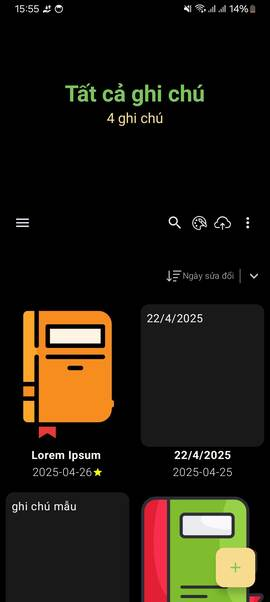
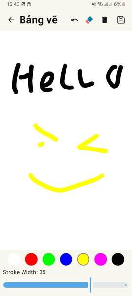
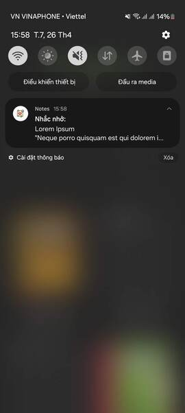

# Notes App (Samsung Notes Clone)

A secure, feature-rich notes and drawing application built natively with **Kotlin** and **Jetpack Compose**. This project demonstrates the implementation of a **clean MVVM architecture**, multi-layered security, and advanced data persistence strategies for a robust mobile productivity tool.

## Screenshots

| Home Screen | Edit Screen | Drawing Tool | Notifying |  
|  |  |  |


## ✨ Key Features

* **Advanced Note Management:** Implements full note lifecycle management (CRUD) with support for rich content, reminders, and categorized organization.
* **Storage & Synchronization:** Supports offline persistence using **Room Database** and cloud backup/synchronization via **Firebase Storage**.
* **Extended Functionality:** Integrated drawing tool, ability to save notes as local files, and cross-platform content sharing capabilities.
* **Modern UI/UX:** Built with **Jetpack Compose** following Material Design principles, featuring an adaptive Dark/Light theme.


## 🛠️ Tech Stack & Architecture

| Category | Tool / Pattern |
| **Language** | Kotlin |
| **UI Framework** | **Jetpack Compose** (Modern Declarative UI) |
| **Architecture** | **MVVM** (Model-View-ViewModel) |
| **Data Persistence** | Room Database, Firebase (Cloud Storage) |
| **Cloud Services** | Firebase Authentication (Social Login) |
| **Security** | BiometricPrompt, Firebase Auth |
| **Concurrency** | Kotlin Coroutines, WorkManager |

## 🚀 Getting Started

1.  **Clone Repository:**
    ```bash
    git clone https://github.com/1heroflutter/Notes
    ```
2.  **Firebase Setup:** Create a new Firebase project and place the generated `google-services.json` file into the `app/` directory. Enable **Authentication** and **Cloud Firestore** services.
3.  **Open Project:** Open the project using Android Studio/Visual Studio Code (latest version recommended),.
4.  **Build & Run:** Run the application on an emulator or a physical device.